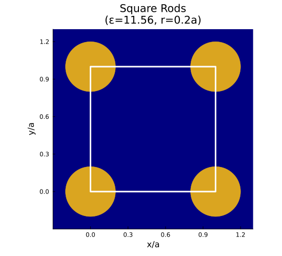
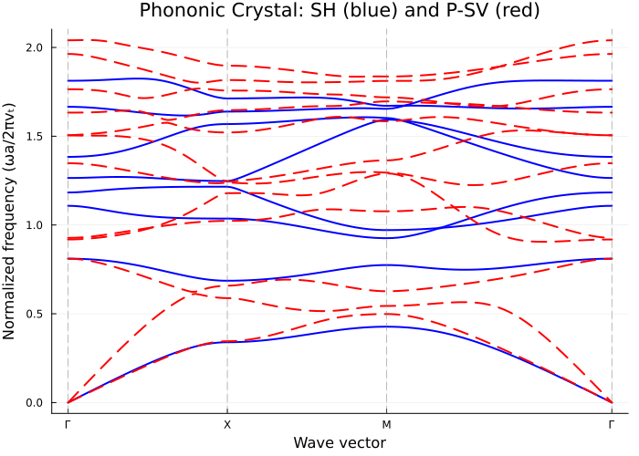

# Examples

## 2D Photonic Crystals

### Triangular Lattice Rods (TM mode)

Source: `examples/101_triangular_rods.jl`

Dielectric rods (ε=12) in air, radius r=0.2a.


```julia
lat = hexagonal_lattice(1.0)
air = Dielectric(1.0)
rod = Dielectric(12.0)
geo = Geometry(lat, air, [(Circle([0.0, 0.0], 0.2), rod)])

solver = Solver(TMWave(), geo, (64, 64); cutoff=7)
kpath = simple_kpath_hexagonal(npoints=30)
bands = compute_bands(solver, kpath; bands=1:8)
```


The TM mode shows a clear band gap between bands 1 and 2.

---

### Square Lattice Rods (TE/TM comparison)

Source: `examples/103_square_rods.jl`



```julia
lat = square_lattice(1.0)
geo = Geometry(lat, air, [(Circle([0.0, 0.0], 0.2), rod)])

solver_te = Solver(TEWave(), geo, (64, 64); cutoff=7)
solver_tm = Solver(TMWave(), geo, (64, 64); cutoff=7)
```


This example also demonstrates iterative solvers:

```julia
# KrylovKit (Arnoldi iteration)
solver = Solver(TMWave(), geo, (64, 64), KrylovKitMethod())

# LOBPCG (Block CG)
solver = Solver(TMWave(), geo, (64, 64), LOBPCGMethod())
```

---

## 2D Phononic Crystals

### Steel/Epoxy (SH and P-SV modes)

Source: `examples/201_phononic_steel_epoxy.jl`

Steel cylinders in epoxy matrix.

```julia
epoxy = IsotropicElastic(ρ=1180.0, λ=4.43e9, μ=1.59e9)
steel = IsotropicElastic(ρ=7800.0, λ=1.15e11, μ=8.28e10)

lat = square_lattice(0.01)  # 1 cm period
geo = Geometry(lat, epoxy, [(Circle([0.0, 0.0], 0.004), steel)])

solver_sh = Solver(SHWave(), geo, (64, 64); cutoff=7)
solver_psv = Solver(PSVWave(), geo, (64, 64); cutoff=7)
```



This example also compares Dense, KrylovKit, and LOBPCG methods for phononic problems.

---

## 1D Structures

### Bragg Reflector

Source: `examples/301_bragg_reflector.jl`

Quarter-wave stack of two dielectric materials.


```julia
lat = lattice_1d(1.0)
mat1 = Dielectric(1.0)
mat2 = Dielectric(12.0)

# Quarter-wave thickness ratio
d1 = 0.5 * sqrt(12) / (1 + sqrt(12))
geo = Geometry(lat, mat1, [(Segment(0.0, d1), mat2)])

solver = Solver(Photonic1D(), geo, 128; cutoff=20)

# Or with iterative solvers
solver = Solver(Photonic1D(), geo, 128, KrylovKitMethod(); cutoff=20)
solver = Solver(Photonic1D(), geo, 128, LOBPCGMethod(); cutoff=20)
```


---

## 3D Photonic Crystals

### FCC Lattice with Spheres

Source: `examples/401_fcc_spheres.jl`

Dielectric spheres (ε=12) in air on an FCC lattice.

```julia
lat = fcc_lattice(1.0)
air = Dielectric(1.0)
sphere = Dielectric(12.0)
geo = Geometry(lat, air, [(Sphere([0.0, 0.0, 0.0], 0.25), sphere)])

# 3D requires shift-and-invert to skip spurious longitudinal modes
# Use cutoff≥7 for high-contrast materials (ε=12)
solver = Solver(FullVectorEM(), geo, (12, 12, 12), KrylovKitMethod(shift=0.01); cutoff=7)

# Use 3D k-path
kpath = simple_kpath_fcc(a=1.0, npoints=20)
bands = compute_bands(solver, kpath; bands=1:6)
```

**Note**: At Γ point (k=0), the lowest transverse modes also have ω→0,
which can cause anomalous values in band structure plots.

---

### Simple Cubic Lattice with Spheres

Source: `examples/402_sc_spheres.jl`

```julia
lat = cubic_lattice(1.0)
geo = Geometry(lat, air, [(Sphere([0.0, 0.0, 0.0], 0.3), sphere)])

# cutoff=7 recommended for ε=12 contrast
solver = Solver(FullVectorEM(), geo, (12, 12, 12), KrylovKitMethod(shift=0.01); cutoff=7)
kpath = simple_kpath_cubic(a=1.0, npoints=20)
bands = compute_bands(solver, kpath; bands=1:6)
```

---

## More Examples

See the `examples/` directory in the repository for additional examples:

| Category | File | Description |
|----------|------|-------------|
| 2D Photonic | `104_honeycomb_rods.jl` | Honeycomb lattice |
| 2D Photonic | `111_triangular_holes.jl` | Air holes in dielectric |
| 2D Photonic | `121_subpixel_comparison.jl` | Convergence with subpixel averaging |
| 1D Elastic | `302_elastic_superlattice.jl` | Elastic wave superlattice |
| 3D Phononic | `403_sc_phononic.jl` | Simple cubic phononic |
| Defect | `501_defect_mode.jl` | Defect states and LDOS |
| TMM | `601_tmm_bragg_mirror.jl` | Transfer matrix method |
