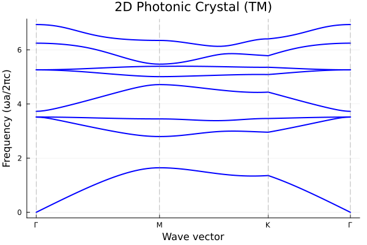

# Getting Started

This guide will help you get your first band structure calculation running in under 5 minutes.

## Installation

```julia
using Pkg
Pkg.add("PhoXonic")
Pkg.add("Plots")  # For plotting
```

## Your First Calculation: 2D Photonic Crystal

See also: [`examples/101_triangular_rods.jl`](https://github.com/hsugawa8651/PhoXonic.jl/blob/main/examples/101_triangular_rods.jl)

Let's compute the band structure of a 2D photonic crystal with dielectric rods in a triangular lattice.

### Step 1: Define the Structure

A triangular lattice photonic crystal with dielectric rods (ε = 12) in air.

```julia
using PhoXonic

# Create triangular (hexagonal) lattice with period a = 1
lat = hexagonal_lattice(1.0)

# Define materials
air = Dielectric(1.0)
rod = Dielectric(12.0)  # High dielectric (e.g., GaAs or Si)

# Geometry: air background with dielectric rod at center
geo = Geometry(lat, air, [(Circle([0.0, 0.0], 0.2), rod)])
```

### Step 2: Create Solver and Compute Bands

```julia
# Create solver for TM polarization
solver = Solver(TMWave(), geo, (64, 64); cutoff=7)

# Define k-path: Γ → M → K → Γ
kpath = simple_kpath_hexagonal(; a=1.0, npoints=30)

# Compute band structure
bands = compute_bands(solver, kpath; bands=1:8)
```

**Parameters:**
- `(64, 64)`: Grid resolution for discretizing the unit cell
- `cutoff=7`: Number of reciprocal lattice vectors included (higher = more accurate but slower)

The returned `bands` object is a [`BandStructure`](@ref) containing frequencies, k-points, and labels. It can be passed directly to [`plot_bands`](@ref) and [`find_all_gaps`](@ref). See [Workflow](@ref) for details.

### Step 3: Find Band Gaps

```julia
gaps = find_all_gaps(bands)
for g in gaps
    println("Gap between bands $(g.bands): $(round(g.gap_ratio*100; digits=1))% gap-to-midgap")
end
```

Expected output:
```
Gap between bands (1, 2): 47.4% gap-to-midgap
```

## Plotting the Band Structure

```julia
using Plots

plot_bands(bands;
    xlabel = "Wave vector",
    ylabel = "Frequency (ωa/2πc)",
    title = "2D Photonic Crystal (TM)"
)
```



This band diagram shows a clear photonic band gap between the first and second bands (~50% gap-to-midgap ratio).

## Next Steps

Now that you've run your first calculation, explore more:

- **[Workflow](@ref)**: Detailed workflow for 2D photonic and phononic crystals
- **[3D Calculations](@ref)**: Full vector EM and elastic wave calculations
- **[Examples](examples.md)**: Complete example scripts with various structures
- **[Solver Methods](@ref)**: Choose the right solver for your problem size
- **[API Reference](api.md)**: Full documentation of all functions

## Quick Reference

| Structure | Wave Type | Lattice | Example |
|-----------|-----------|---------|---------|
| [1D photonic](workflow_1d.md#1D-Photonic-Crystal) | [`Photonic1D()`](@ref Photonic1D) | [`lattice_1d(a)`](@ref lattice_1d) | [`301`](https://github.com/hsugawa8651/PhoXonic.jl/blob/main/examples/301_bragg_reflector.jl) |
| [1D phononic](workflow_1d.md#1D-Phononic-Crystal) | [`Longitudinal1D()`](@ref Longitudinal1D) | [`lattice_1d(a)`](@ref lattice_1d) | [`302`](https://github.com/hsugawa8651/PhoXonic.jl/blob/main/examples/302_elastic_superlattice.jl) |
| [2D photonic TE](workflow.md#2D-Photonic-Crystal) | [`TEWave()`](@ref TEWave) | [`square_lattice(a)`](@ref square_lattice), [`hexagonal_lattice(a)`](@ref hexagonal_lattice) | [`103`](https://github.com/hsugawa8651/PhoXonic.jl/blob/main/examples/103_square_rods.jl) |
| [2D photonic TM](workflow.md#2D-Photonic-Crystal) | [`TMWave()`](@ref TMWave) | [`square_lattice(a)`](@ref square_lattice), [`hexagonal_lattice(a)`](@ref hexagonal_lattice) | [`101`](https://github.com/hsugawa8651/PhoXonic.jl/blob/main/examples/101_triangular_rods.jl) |
| [2D phononic SH](workflow.md#2D-Phononic-Crystal) | [`SHWave()`](@ref SHWave) | [`square_lattice(a)`](@ref square_lattice), [`hexagonal_lattice(a)`](@ref hexagonal_lattice) | [`201`](https://github.com/hsugawa8651/PhoXonic.jl/blob/main/examples/201_phononic_steel_epoxy.jl) |
| [2D phononic P-SV](workflow.md#2D-Phononic-Crystal) | [`PSVWave()`](@ref PSVWave) | [`square_lattice(a)`](@ref square_lattice), [`hexagonal_lattice(a)`](@ref hexagonal_lattice) | [`201`](https://github.com/hsugawa8651/PhoXonic.jl/blob/main/examples/201_phononic_steel_epoxy.jl) |
| [3D photonic](workflow_3d.md#3D-Photonic-Crystals) | [`TransverseEM()`](@ref TransverseEM) | [`cubic_lattice(a)`](@ref cubic_lattice), [`fcc_lattice(a)`](@ref fcc_lattice) | [`401`](https://github.com/hsugawa8651/PhoXonic.jl/blob/main/examples/401_fcc_spheres.jl) |
| [3D phononic](workflow_3d.md#3D-Phononic-Crystals) | [`FullElastic()`](@ref FullElastic) | [`cubic_lattice(a)`](@ref cubic_lattice), [`fcc_lattice(a)`](@ref fcc_lattice) | — |
