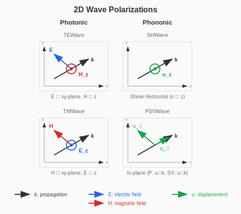

# Workflow

## Wave Types and Polarizations

PhoXonic.jl supports various wave types for photonic and phononic crystals.

### 2D Wave Types



| Wave Type | Field Components | Description |
|-----------|-----------------|-------------|
| `TEWave` | H_z | E in xy-plane, H perpendicular |
| `TMWave` | E_z | H in xy-plane, E perpendicular |
| `SHWave` | u_z | Shear horizontal (anti-plane) |
| `PSVWave` | u_x, u_y | In-plane (P + SV coupled) |

For 3D wave types, see [3D Calculations](@ref).

## Basic Workflow

1. Define [Lattice](@ref) (`square_lattice`, `hexagonal_lattice`, etc.)
2. Define [Materials](@ref) (`Dielectric`, `IsotropicElastic`)
3. Create [Geometry](@ref) with [Shapes](@ref) (`Circle`, `Rectangle`, `Sphere`, etc.)
4. Create [Solver](@ref) with [Wave Types](@ref) — see also [Solver Methods](@ref)
5. Compute [Band Structure](@ref) (`compute_bands`)
6. Analyze results — see [Analysis and Post-Processing](@ref)

## 2D Photonic Crystal

### Triangular Lattice Rods (TM mode)

```julia
using PhoXonic

# 1. Lattice
lat = hexagonal_lattice(1.0)

# 2. Materials
air = Dielectric(1.0)
rod = Dielectric(12.0)  # High-ε like GaAs

# 3. Geometry: rods in air
geo = Geometry(lat, air, [(Circle([0.0, 0.0], 0.2), rod)])

# 4. Solver
solver = Solver(TMWave(), geo, (64, 64); cutoff=7)

# 5. Compute bands
kpath = simple_kpath_hexagonal(npoints=30)
bands = compute_bands(solver, kpath; bands=1:8)

# 6. Find gaps
gaps = find_all_gaps(bands)
for g in gaps
    println("Gap between bands $(g.bands): $(g.gap_ratio*100)%")
end
```

### Square Lattice (TE/TM comparison)

```julia
lat = square_lattice(1.0)
geo = Geometry(lat, air, [(Circle([0.0, 0.0], 0.2), rod)])

# TE mode
solver_te = Solver(TEWave(), geo, (64, 64); cutoff=7)
bands_te = compute_bands(solver_te, kpath; bands=1:8)

# TM mode
solver_tm = Solver(TMWave(), geo, (64, 64); cutoff=7)
bands_tm = compute_bands(solver_tm, kpath; bands=1:8)
```

## 2D Phononic Crystal

### Steel/Epoxy (SH mode)

```julia
# Materials
epoxy = IsotropicElastic(ρ=1180.0, λ=4.43e9, μ=1.59e9)
steel = IsotropicElastic(ρ=7800.0, λ=1.15e11, μ=8.28e10)

# Geometry
lat = square_lattice(0.01)  # 1 cm period
geo = Geometry(lat, epoxy, [(Circle([0.0, 0.0], 0.004), steel)])

# SH solver
solver = Solver(SHWave(), geo, (64, 64); cutoff=7)
kpath = simple_kpath_square(a=0.01, npoints=30)
bands = compute_bands(solver, kpath; bands=1:8)
```

### P-SV Mode (in-plane)

```julia
solver_psv = Solver(PSVWave(), geo, (64, 64); cutoff=7)
bands_psv = compute_bands(solver_psv, kpath; bands=1:12)
```

## 1D Structures

### Bragg Reflector (Photonic)

```julia
lat = lattice_1d(1.0)
mat1 = Dielectric(1.0)
mat2 = Dielectric(12.0)

# Quarter-wave stack: d1/d2 = n2/n1
d1 = 0.5 * sqrt(12) / (1 + sqrt(12))
geo = Geometry(lat, mat1, [(Segment(0.0, d1), mat2)])

solver = Solver(Photonic1D(), geo, 128; cutoff=20)
```

### Elastic Superlattice (Phononic)

```julia
lat = lattice_1d(0.01)  # 1 cm period
steel = IsotropicElastic(ρ=7800.0, λ=115e9, μ=82e9)
epoxy = IsotropicElastic(ρ=1180.0, λ=4.43e9, μ=1.59e9)
geo = Geometry(lat, epoxy, [(Segment(0.0, 0.5), steel)])

solver = Solver(Longitudinal1D(), geo, 128; cutoff=20)
```

## Subpixel Averaging

For smoother convergence at material boundaries:

```julia
solver = Solver(TMWave(), geo, (64, 64);
    cutoff=7,
    discretization=SubpixelAverage(4)  # 4×4 subsampling
)
```

For 3D photonic/phononic crystals (FullVectorEM, FullElastic), see [3D Calculations](@ref).

For solver methods (DenseMethod, KrylovKitMethod, LOBPCGMethod), see [Solver Methods](@ref).

For post-processing (convergence, group velocity, k-path, plotting, saving/loading),
see [Analysis and Post-Processing](@ref).
