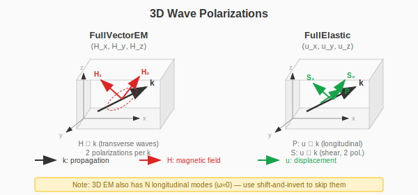

# 3D Calculations

3D photonic and phononic crystal calculations have special considerations
due to the vector nature of the fields and the presence of spurious modes.

## 3D Wave Types



| Wave Type | Field Components | Description |
|-----------|-----------------|-------------|
| `FullVectorEM` | H_x, H_y, H_z | Full vector H-field (2 transverse modes per k) |
| `FullElastic` | u_x, u_y, u_z | Full elastic (1 P + 2 S modes per k) |

## 3D Photonic Crystals

### FCC Lattice with Spheres

```julia
lat = fcc_lattice(1.0)
air = Dielectric(1.0, 1.0)
rod = Dielectric(12.0, 1.0)
geo = Geometry(lat, air, [(Sphere([0.0, 0.0, 0.0], 0.2), rod)])

solver = Solver(FullVectorEM(), geo, (16, 16, 16); cutoff=7)
```

### Simple Cubic Lattice

```julia
lat = cubic_lattice(1.0)
geo = Geometry(lat, air, [(Sphere([0.0, 0.0, 0.0], 0.3), rod)])

solver = Solver(FullVectorEM(), geo, (16, 16, 16); cutoff=7)
kpath = simple_kpath_cubic(a=1.0, npoints=20)
bands = compute_bands(solver, kpath; bands=1:6)
```

## H-field Formulation

The 3D implementation uses the H-field formulation:

```
∇ × (ε⁻¹ ∇ × H) = (ω/c)² μ H
```

This produces:
- **N longitudinal modes** with ω ≈ 0 (unphysical, violate ∇·H = 0)
- **2N transverse modes** with physical frequencies (electromagnetic waves)

For homogeneous medium, transverse modes satisfy ω = c|k|.

### Handling Longitudinal Modes

Use `shift > 0` in solver methods to filter out spurious longitudinal modes:

```julia
# DenseMethod: post-hoc filtering
solver = Solver(FullVectorEM(), geo, (12, 12, 12), DenseMethod(shift=0.01); cutoff=7)

# KrylovKitMethod: shift-and-invert
solver = Solver(FullVectorEM(), geo, (16, 16, 16), KrylovKitMethod(shift=0.01); cutoff=7)

# LOBPCGMethod: shift-and-invert
solver = Solver(FullVectorEM(), geo, (16, 16, 16), LOBPCGMethod(shift=0.01); cutoff=7)
```

See [Solver Methods](@ref) for details on shift-and-invert.

## Cutoff Convergence

For 3D photonic crystals with high dielectric contrast (ε > 10), sufficient plane waves
are required for accurate band structure calculation.

**SC lattice convergence** (benchmark against MPB):

| cutoff | Plane waves (approx.) | Accuracy |
|--------|----------------------|----------|
| 3 | ~120 | Poor (~20% error) |
| 5 | ~500 | Moderate (~7% error) |
| 7 | ~1400 | Good (< 1% error) |

**Note:** FCC lattice may require different optimal settings. See [MPB Benchmark Results](@ref) below.

**Recommended cutoff values:**

| Dielectric contrast | Minimum cutoff |
|--------------------|----------------|
| ε < 4 | 3–5 |
| 4 ≤ ε < 10 | 5–7 |
| ε ≥ 10 | 7+ |

**Example convergence test:**

```julia
for cutoff in [3, 5, 7]
    solver = Solver(FullVectorEM(), geo, (16,16,16); cutoff=cutoff)
    bands = compute_bands(solver, kpath; bands=1:6)
    println("cutoff=$cutoff: ω₁ = $(bands.frequencies[1,1])")
end
```

**Note:** Higher cutoff increases computation time significantly.
Use iterative methods ([`KrylovKitMethod`](api-solver.md#PhoXonic.KrylovKitMethod) or [`LOBPCGMethod`](api-solver.md#PhoXonic.LOBPCGMethod)) for cutoff ≥ 7.

## 3D Phononic Crystals

### Full Elastic Wave

```julia
lat = cubic_lattice(0.01)  # 1 cm period
epoxy = IsotropicElastic(ρ=1180.0, λ=4.43e9, μ=1.59e9)
steel = IsotropicElastic(ρ=7800.0, λ=1.15e11, μ=8.28e10)
geo = Geometry(lat, epoxy, [(Sphere([0.0, 0.0, 0.0], 0.004), steel)])

solver = Solver(FullElastic(), geo, (16, 16, 16), KrylovKitMethod(shift=0.01); cutoff=5)
```

## 3D K-paths

```julia
# FCC lattice
kpath = simple_kpath_fcc(a=1.0, npoints=20)

# Simple cubic
kpath = simple_kpath_cubic(a=1.0, npoints=20)

# BCC lattice
kpath = simple_kpath_bcc(a=1.0, npoints=20)
```

## MPB Benchmark Results

PhoXonic 3D calculations have been validated against [MIT Photonic Bands (MPB)](https://mpb.readthedocs.io/).

### Simple Cubic (SC) Lattice

For SC lattice with ε=12 sphere (r=0.3):

| cutoff | Plane waves | Error vs MPB |
|--------|------------|--------------|
| 3 | 123 | 24% |
| 5 | 515 | 7% |
| **7** | **1419** | **< 1%** |

**Recommended settings for SC:**
```julia
resolution = (16, 16, 16)
cutoff = 7
solver = Solver(FullVectorEM(), geo, resolution, KrylovKitMethod(shift=0.01); cutoff=cutoff)
```

### FCC Lattice

For FCC lattice with ε=12 sphere (r=0.25):

| Resolution | cutoff | Error vs MPB |
|------------|--------|--------------|
| 12×12×12 | 6 | **~4%** |
| 16×16×16 | 6 | ~10% |
| 12×12×12 | 7 | Complex* |

*At cutoff≥7, additional modes from light-cone band folding appear, complicating band identification.

**Recommended settings for FCC:**
```julia
resolution = (12, 12, 12)
cutoff = 6
solver = Solver(FullVectorEM(), geo, resolution, KrylovKitMethod(shift=0.01); cutoff=cutoff)
```

### Important Notes on MPB Comparison

1. **Lattice normalization**: MPB internally normalizes primitive lattice vectors to unit length.
   This affects the fill fraction interpretation:
   - PhoXonic FCC primitive vector: |a| = 1/√2 ≈ 0.707
   - MPB FCC primitive vector: |a| = 1.0 (normalized)

2. **Frequency units**:
   - MPB: f = ω·a/(2πc)
   - PhoXonic: ω (angular frequency with c=1)
   - Conversion: ω_PhoXonic = 2π × f_MPB

3. **Fill fraction**: With the same `r=0.25`:
   - PhoXonic: ~26% fill
   - MPB: ~9% fill

   For exact comparison, match fill fractions or mean ε values.

## Memory Considerations

3D calculations require significantly more memory than 2D:

| Resolution | Plane waves (cutoff=7) | Dense matrix memory |
|------------|----------------------|---------------------|
| 12×12×12 | ~500 | ~6 GB |
| 16×16×16 | ~1400 | ~47 GB |
| 20×20×20 | ~2700 | ~175 GB |

For large 3D systems, use matrix-free methods. See [Matrix-Free Methods](@ref).

## API Reference

- [Solver API](api-solver.md) - FullVectorEM, FullElastic, Solver methods
- [Advanced API](api-advanced.md) - Matrix-free operators
